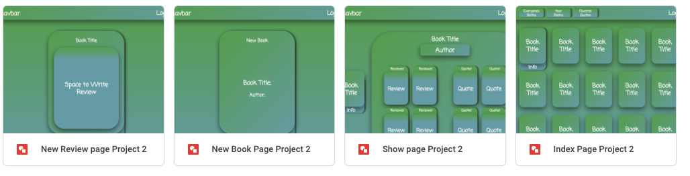
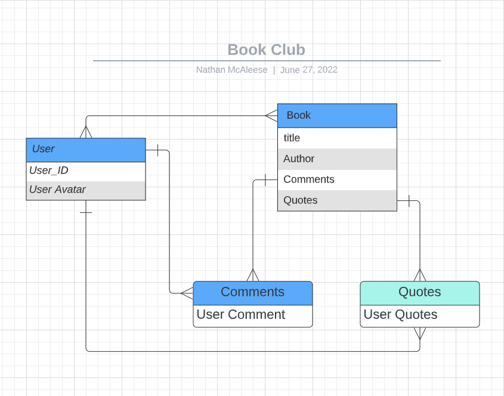
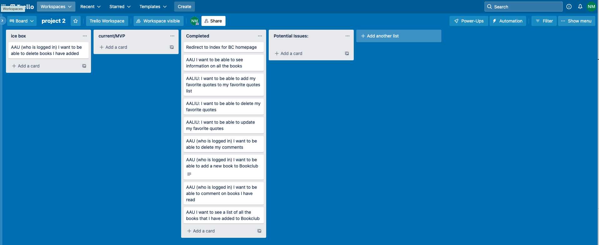
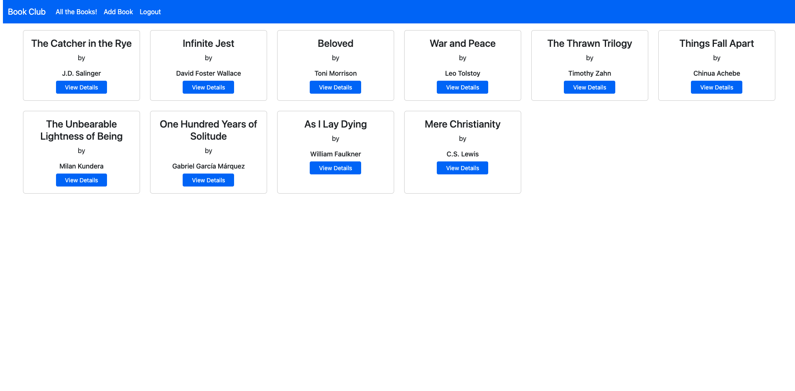
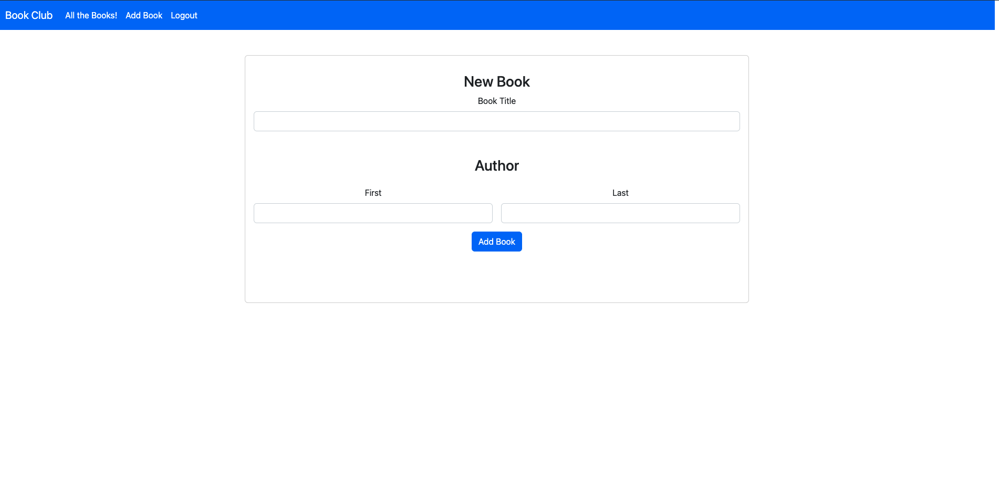
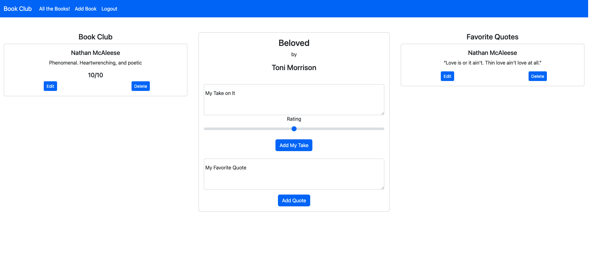
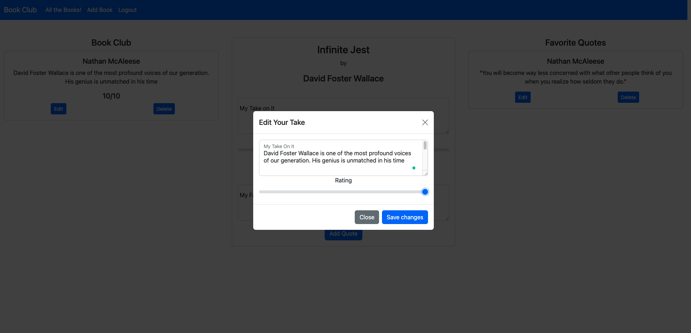

# book-club

Minimalistic design for creating a digital library of books! Add books, read other user's reviews and ratings of your favorite books, and post your favorite quotes!

# Screenshots

# Technologies Used:

JavaScript, CSS, HTML, Node.js, Express, MongoDB, Mongoose, Google Oath, 

# Getting Started:

https://nathans-book-club.herokuapp.com/books
# Next Steps:

ICE BOX:

- Adding edit comment functionality for all users
- creating a reference relationship between author and books so users can view all books an author has written
- creating personal libraries for users